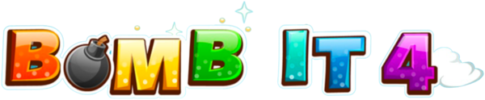
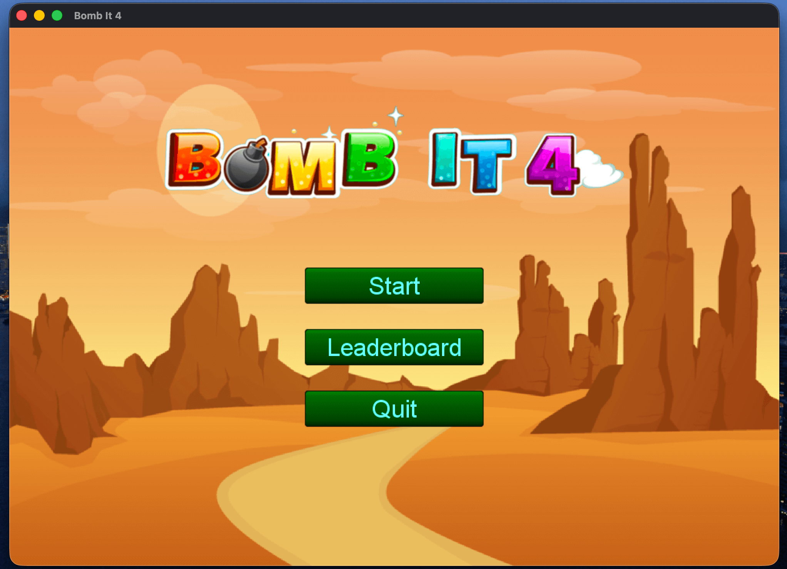
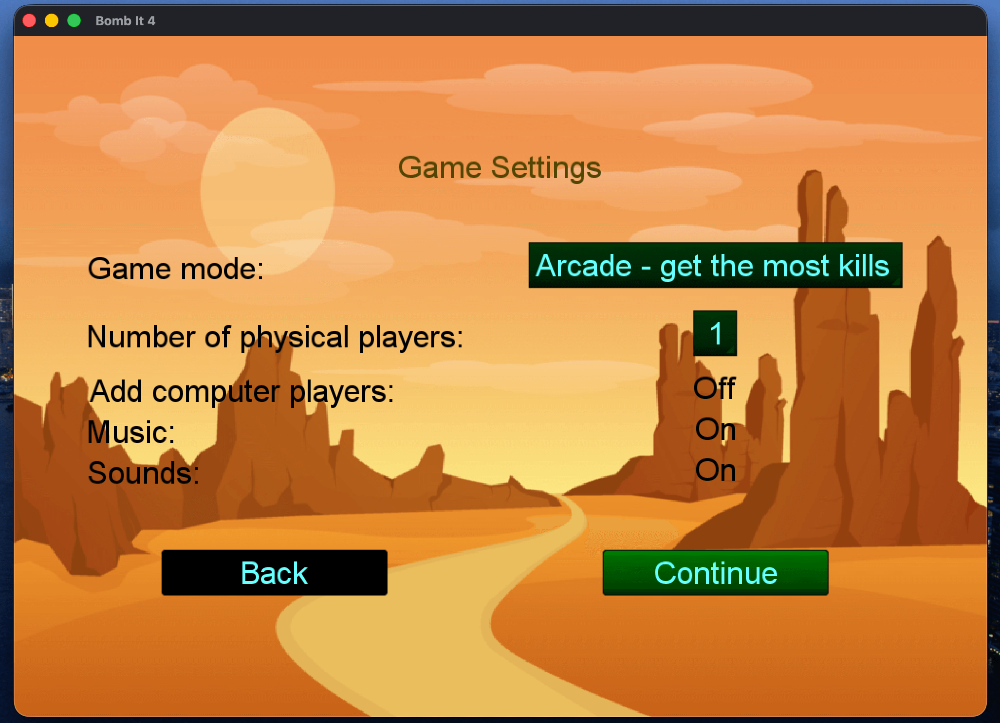
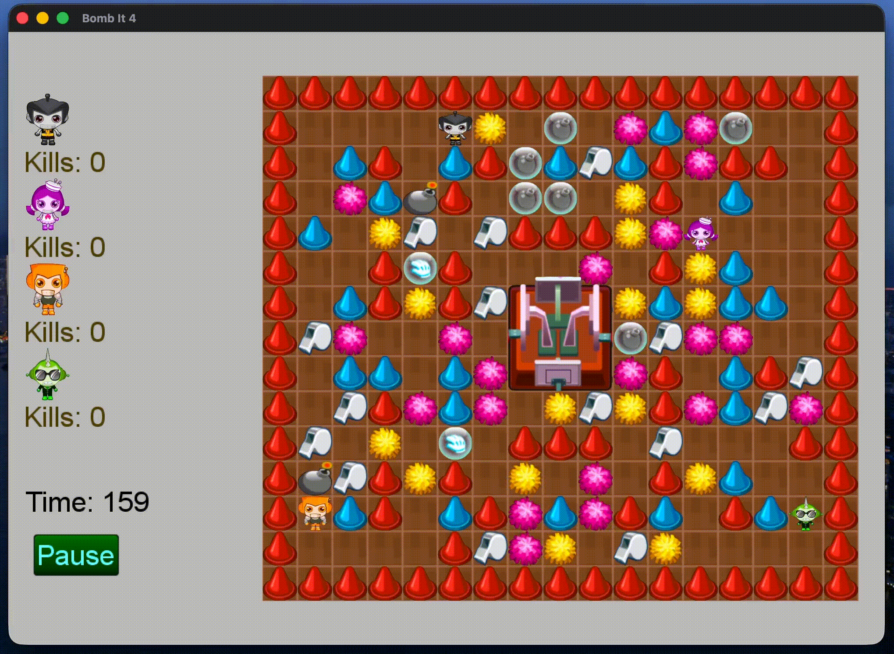
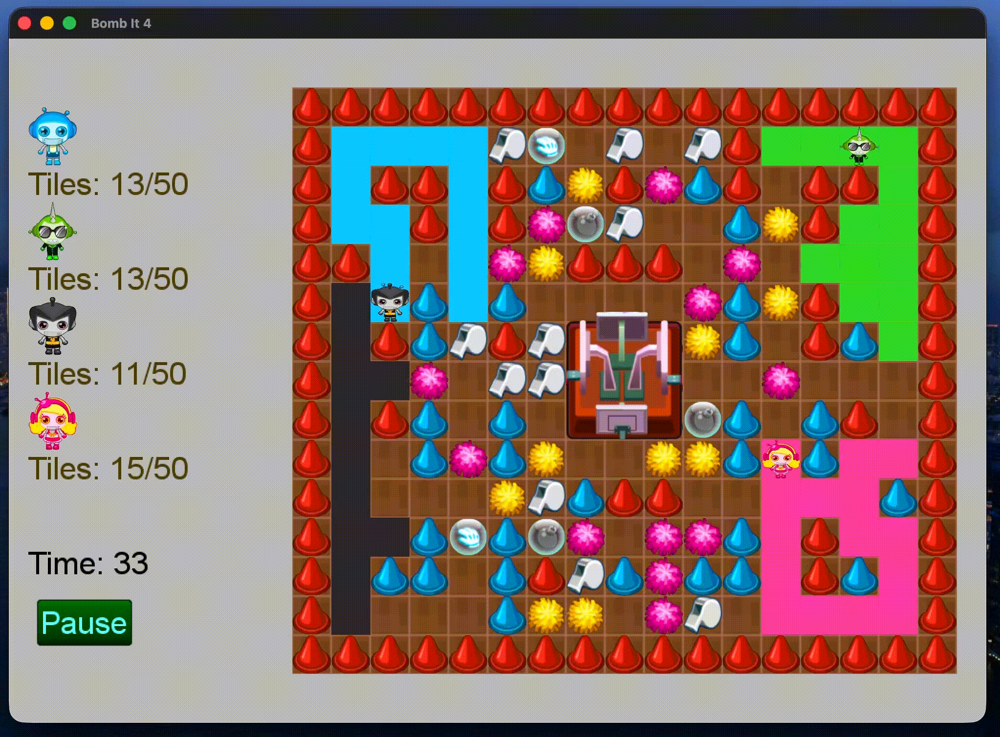
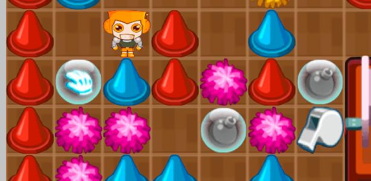

<br>

<p align="center"></p>

<h1 align="center"><b>Bomb It</b></h1>

<p align="center"><b>Local multiplayer bomber-style game 💻 🕹️</b></p>

<p align="center"><b>Built with cross-platform Java library <a href="https://github.com/libgdx/libgdx">libGDX</a></b></p>

<br>

## ✍️ Overview

Based on a widely popular Flash game series named Bomb It. Specifically the Bomb It 4.

<br>

## 🎮 Features

- 💻 local multiplayer for up to 2 players
- 🤖 up to 4 players in total, the rest can be filled with computer bots
- 🏆 2 game modes
- 💣 bombs
- ⭐️ collectable bonuses
- 🧱 fixed and removable obstacles
- 🌈 character selection
- 📊 local leaderboard

<p align="center"></p>

<p align="center"></p>

<br>

## 🕹️ Game modes

### Arcade

- 💣 drop bombs to eliminate players
- 🏃 detonations kill any player in range!
- 🪦 eliminated players re-spawn at their starting locations
- 📊 score points by eliminating opponents
- 🏆 **when time runs out, the player with the most kills wins the game**

<p align="center"></p>

<br>

### Tile Tag

- 🎨 each player has a unique color based on the character
- 🫟 moving across a floor tile paints it
- 🏆 **the first to have 50 active tiles wins**
- 💣 bombs still matter!
- 🪦 re-spawning resets the player's already colored tiles
- ⏰ no timer
- 🏃 move fast before others steal your tiles!

<p align="center"></p>

<br>

## ⚙️ Gameplay mechanics

Each player has a starting spawn point in his respective corner. Each player also has a unique look that can be selected at the start of the game. The look also auto sets a color for the Tile Tag mode.

With each player starting in its own corner, the map is filled with many obstacles. Obstacles can be permanent (traffic cones) or temporary, which can be removed with a bomb. The players have to remove these obstacles to move across the map, get to other players and fulfil the game goals.

Players can drop bombs and kill players in bomb range, even the dropper. In all modes players re-spawn in their starting points. Note that in the Tile Tag mode this resets your progress.

<br>

## 🎁 Bonuses

<p align="center"></p>

- 💣 **Bomb Capacity**
  - at the start the player can drop only one bomb and before he can drop another, the first one has to detonate
  - each collected bomb bonus increases how many active bombs a player can have
- 🧤 **Glove**
  - ability to push an active bomb to the end of the path by bumping into it

<br>

## 📝 About the Bomb It series

First version of Bomb It was developed by Zlong Games and published by Spil Games in November of 2006.

The game worked over Flash at the time. Today all of the games have been ported over and can be played via HTML5.

There are 8 versions. With the Bomb It 8 being published as recent as 2023.

<br>

## 💻 Get started

### Requirements

- **Java SDK** (tested with 21)
- **A Java IDE** (tested with IntelliJ IDEA, Android Studio should also be good)
- tested on macOS, should work elsewhere as well

### Running the game

The game can be run via Gradle with the desktop build file:

```sh
./gradlew desktop:run
```

<br>

## ❤️ Development background

The game was developed as a student project at computer science university FERI in Maribor, Slovenia during my 2023/2024 school year.
